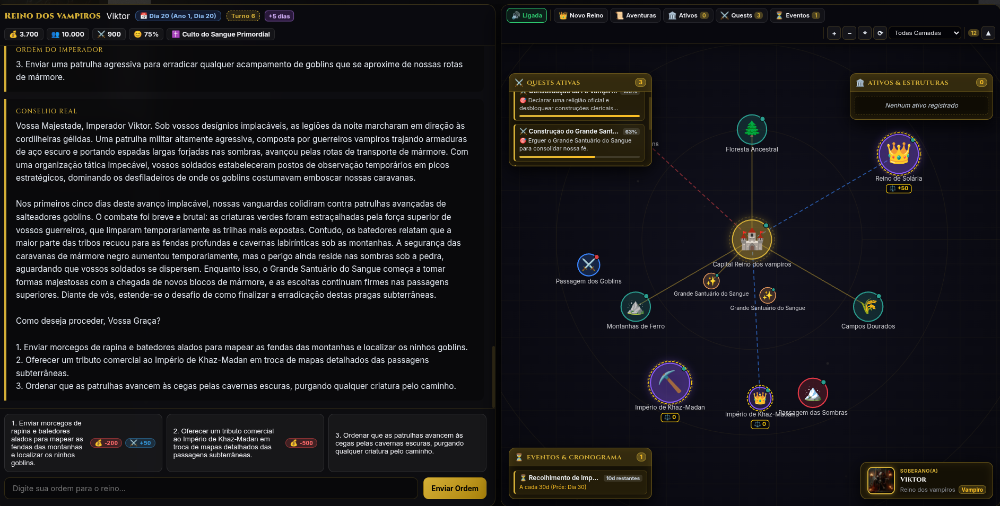

# AI RPG Game - Layered Architecture & Autonomous Simulation Engine

Sistema de RPG medieval tático e narrativo orientado a eventos, orquestrado por múltiplos provedores de Inteligência Artificial (LLMs), memória episódica vetorial (RAG) e persistência relacional em SQLite3.



---

## Visão Geral do Sistema

O **AI RPG Game** combina narrativa procedural guiada por modelos de linguagem com mecânicas de simulação econômica e geopolítica de um reino medieval. O jogador atua como governante, tomando decisões estratégicas ou propondo ações livres que afetam diretamente métricas de população, tesouro, poderio militar, humor da população e relações com personagens e facções.

O projeto foi concebido sob princípios rigorosos de Clean Architecture e Domain-Driven Design (DDD), isolando a lógica de negócio tanto da interface gráfica quanto dos provedores externos de inteligência artificial.

---

## Arquitetura do Projeto

O sistema é dividido em camadas estritamente desacopladas, onde o fluxo de dependência aponta sempre para o domínio interno:

```
[ Camada de Apresentacao ] -> Web SPA (Vanilla HTML5 / CSS3 / JavaScript)
         |
         v (HTTP REST / JSON DTOs)
[ Camada de API / Server ] -> FastAPI (server/app.py, server/dto.py)
         |
         v (Invocacao de Metodos de Dominio)
[ Dominio & Orquestracao ] -> GameEngine, StateManager (engine/domain/)
         |
         +---> [ Memoria & RAG ] -> ContextBuilder, ImportanceScorer (engine/memory/)
         |           |
         |           v
         +---> [ Persistencia ]  -> SQLite3 Repository, VectorStore (engine/db/)
         |
         +---> [ Provedores IA ] -> LLMFactory, Gemini, Grok, OpenAI, Ollama (engine/providers/)
```

### Detalhamento das Camadas

### 1. Camada de Apresentacao (`web/`)
Interface Single Page Application (SPA) desenvolvida em Vanilla JavaScript, HTML5 e CSS3 moderno (estilo Glassmorphism). Oferece HUD em tempo real com métricas do reino, console narrativo de crônicas, mapa estratégico com grafos de nós territoriais, gerenciamento de inventário, painel de diplomacia e reprodutor de áudio procedural.

### 2. Camada de API e Interfaces (`server/`)
Servidor HTTP assíncrono construído com **FastAPI**. Responsável por expor endpoints REST para gerenciamento de campanhas, execução de turnos, consulta de detalhes de estado, inspeção de grafos de nós e operações de persistência. Realiza validação de contratos de entrada e saída exclusivamente via DTOs Pydantic (`server/dto.py`), mantendo-se livre de lógica de regras de negócio.

### 3. Camada de Dominio e Orquestracao (`engine/domain/`)
Núcleo da lógica do jogo.
- `GameEngine`: Orquestra o ciclo de vida de cada turno (recebimento da ação, construção de contexto via RAG, chamada ao LLM, aplicação matemática de impactos e persistência transacional).
- `StateManager`: Executa os cálculos do estado do reino (arrecadação de impostos periódicos, variações de recursos, modificadores de humor e balanceamento de regras).
- `models.py`: Entidades e estruturas de dados de domínio puras utilizando `dataclasses` nativas do Python.

### 4. Camada de Memoria e Contexto RAG (`engine/memory/`)
Responsável pela cognição contínua da IA e controle rigoroso de tokens:
- `ContextBuilder`: Constrói dinamicamente os prompts enviados aos LLMs, combinando a persona da campanha, os últimos acontecimentos, o estado atual do reino e memórias contextuais resgatadas via busca semântica.
- `ImportanceScorer`: Avalia o peso de impacto narrativo e factual de cada evento (escala de 0.0 a 1.0) para priorização em memórias de longo prazo.
- `Summarizer`: Mecanismo hierárquico de compressão que consolida capítulos históricos a cada ciclo de turnos, evitando a degradação da janela de contexto.

### 5. Camada de Persistencia e Vetores (`engine/db/`)
Armazenamento local unificado em SQLite3 operando em modo WAL (Write-Ahead Logging) com `PRAGMA foreign_keys = ON`:
- `schema.py`: Definição de tabelas com integridade referencial e deleção em cascata (`campaigns`, `world_state`, `characters`, `quests`, `memories`, `periodic_events`, `campaign_tasks`).
- `repository.py`: Centraliza todas as transações relacionais, consultas e agregações.
- `vector_store.py`: Armazena embeddings vetoriais serializados e realiza busca por similaridade de cosseno combinada com pontuações de relevância e filtros de personagens.

### 6. Camada de Provedores de IA (`engine/providers/`)
Abstração desacoplada de modelos de linguagem:
- `base_provider.py`: Interface abstrata `BaseLLMProvider` que dita contratos para geração de texto, extração de JSON estruturado e geração de embeddings.
- `factory.py`: Fábrica `LLMFactory` com cadeia de resolução dinâmica e fallback automático entre múltiplos provedores em caso de indisponibilidade, timeout ou falhas de rate limit.
- Provedores integrados: Google Gemini (`gemini-2.5-flash`), xAI Grok (`grok-2`), OpenAI (`gpt-4o-mini`), e Ollama local (`llama3.2`).

---

## Arquitetura de Memoria em 4 Niveis

Para assegurar consistência narrativa em campanhas de longa duração, o sistema implementa um pipeline cognitivo estruturado em quatro níveis:

1. **Janela de Contexto Imediata**: Retém as últimas interações diretas para garantir continuidade conversacional imediata.
2. **Estado Estruturado do Mundo**: Persiste quantitativamente ouro, população, exército, felicidade, religião e tarefas em andamento nas tabelas do SQLite.
3. **Memoria Episodica Vetorial (RAG)**: Vetoriza acontecimentos chave e recupera os eventos mais relevantes por proximidade semântica para responder a ações específicas do jogador.
4. **Compressao Hierarquica de Cronicas**: Sintetiza turnos passados em resumos de capítulos periódicos, preservando os fatos essenciais enquanto reduz a pegada de tokens.

---

## Preocupacoes Transversais

### Observabilidade e Logs Estruturados
O sistema implementa instrumentação de logs estruturados em todas as camadas, fornecendo metadados detalhados de execução (`campaign_id`, `turn_number`, `action_type`, `provider`, `duration_ms`, `error_type`). Isso viabiliza o monitoramento de performance de inferência, detecção de anomalias e troubleshooting baseado em evidências concretas, com sanitização automática para garantia de zero vazamento de chaves ou dados sensíveis.

### Documentacao Visual com D2
A arquitetura, fluxos de dados, processos assíncronos e ciclos de vida do motor são modelados formalmente através de diagramas declarativos D2 localizados no diretório `docs/diagrams/`, permitindo a compreensão de qualquer subsistema de forma visual e autoexplicativa.

---

## Como Instalar e Executar

### 1. Pre-requisitos
- Python 3.10 ou superior
- Pip e ambiente virtual configurado

### 2. Instalacao das Dependencias
```bash
./install.sh
```
Ou manualmente através do pip:
```bash
pip install -r requirements.txt
```

### 3. Configuracao de Variaveis de Ambiente (Opcional)
Crie um arquivo `.env` na raiz do projeto com as chaves dos provedores desejados:
```env
GEMINI_API_KEY=sua_chave_gemini
GROK_API_KEY=sua_chave_grok
OPENAI_API_KEY=sua_chave_openai
DEFAULT_LLM_PROVIDER=gemini
```

### 4. Execucao da Aplicacao

- **Iniciar Servidor Web e Interface Grafica**:
  ```bash
  python3 run.py web
  ```
  Acesse no navegador: `http://localhost:8000`

- **Executar Suite Completa de Testes**:
  ```bash
  python3 run.py test
  ```

- **Verificar Diagnostico de Conexao com APIs de IA**:
  ```bash
  python3 run.py check
  ```

---

## Estrutura de Diretorios

```
AI_RPG_GAME/
|-- engine/                      # Nucleo do Motor de Jogo
|   |-- domain/                  # Entidades, regras matematicas e orquestracao
|   |-- db/                      # Repositorio SQLite3, schema e Vector Store (RAG)
|   |-- memory/                  # Context builder, importance score e summarizer
|   `-- providers/               # Adaptadores de LLM (Gemini, Grok, OpenAI, Ollama)
|-- server/                      # Servidor FastAPI e DTOs Pydantic
|-- web/                         # Frontend SPA Glassmorphism (HTML, CSS, JS)
|-- tests/                       # Suite de testes automatizados com Pytest
|-- docs/                        # Base de conhecimento arquitetural e ADRs
|   |-- architecture/            # Documentacao detalhada por subsistema
|   |-- decisions/               # Registros de decisoes arquiteturais (ADRs)
|   |-- diagrams/                # Diagramas declarativos em D2
|   `-- guides/                  # Guias de desenvolvimento e troubleshooting
|-- specs/                       # Especificacoes ativas e concluidas (Kiro Flow)
|-- check_api.py                 # Script de teste e latencia de APIs
|-- config.py                    # Leitura centralizada de configuracoes
`-- run.py                       # Ponto de entrada CLI unificado
```

---

## Qualidade e Testes

A integridade do sistema é garantida por testes unitários e de integração implementados com `pytest`, cobrindo:
- Consistência referencial e queries no SQLite3.
- Cálculo de similaridade e relevância no VectorStore.
- Resolução e fallbacks da fábrica de provedores de LLM.
- Orquestração de turnos, rollback de estado e mecânicas temporais no GameEngine.
- Serialização e validação de contratos na camada FastAPI.
